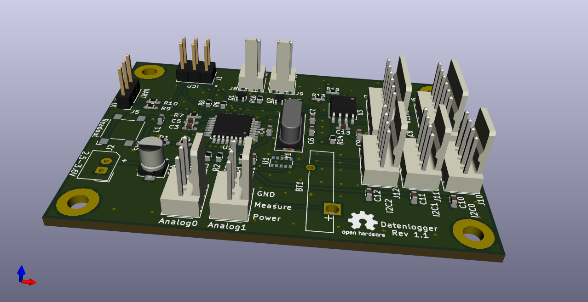

# Datenlogger
Flexible data logger working for many months on cheap AA batteries.

## Status
PCB back from fab, populated and tested. Extensive testroutines available in folder hwtest.
Unfortunatelly PCB rev 1.0 has two missing connections (i2c bus) which requires two ugly wires.
This is fixed in HW revision 1.1.

## what's next
Application software for light sensor under development.